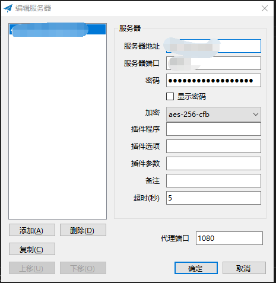
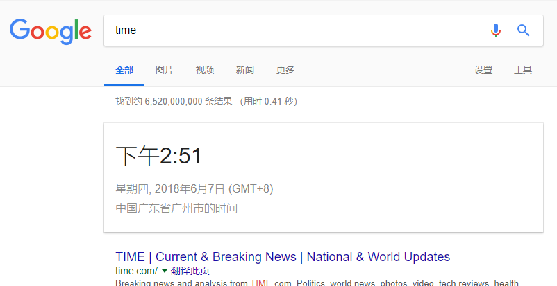

# 需要翻墙到外网的小伙伴

### 下载 shadowsocks

* [Windows]

  https://github.com/shadowsocks/shadowsocks-windows/releases/download/4.0.10/Shadowsocks-4.0.10.zip

* [Mac]

  https://github.com/shadowsocks/ShadowsocksX-NG/releases/download/v1.7.1/ShadowsocksX-NG.1.7.1.zip

### 默认配置

* 连接配置

 

* [Windows]

  1. 右下角 -> `Shadowsocks` -> 启用系统代理
  2. 右下角 -> `Shadossocks` -> 系统代理模式 -> `PAC模式` ~~`勿使用全局模式,会增加服务器带宽`~~

* [Mac]
  1. 顶部状态栏有图标,操作同 `Windows`

### Preview

### Tips

 * 切勿使用大量下载任务 ~~还是可以下载的~~
 * 不要老逛油管，汤不热
